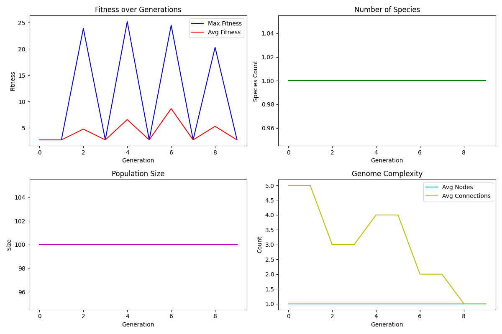

# Flappy Bird AI with NEAT



## Description
AI agent that learns to play Flappy Bird using NEAT algorithm.

## Installation
```bash
git clone https://github.com/yauheniyadrozd/flappy-bird-ai.git
cd flappy-bird-ai
pip install -r requirements.txt
```

## Usage
Train the AI:
```bash
python flappy_bird_ai.py
```

Run with trained model:
```bash
python run_trained.py
```

## Results
Training graphs are saved in `docs/learning_stats.png`